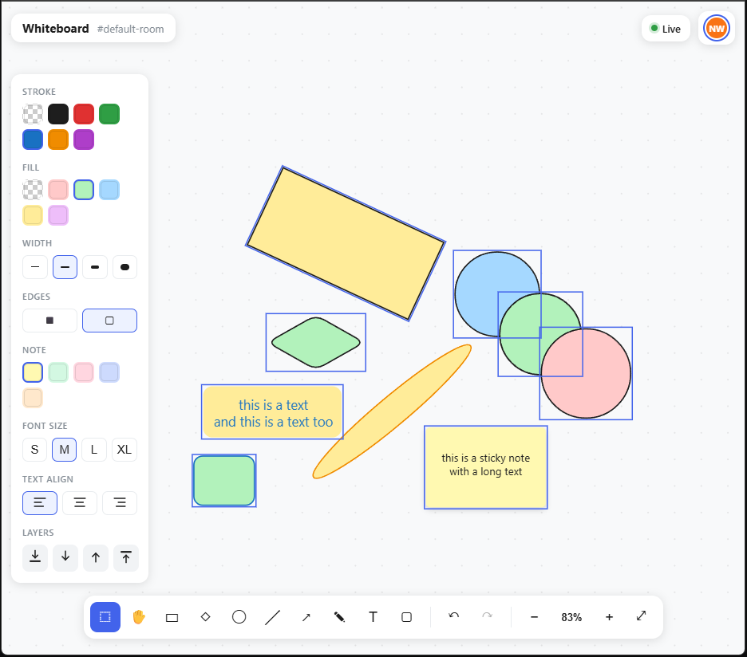

# Realtime Collaborative Whiteboard

A hobby project — basically an Excalidraw clone where multiple people can draw on the same board at the same time and see each other's cursors live. Built mostly with Claude Opus.



Edits sync in real time using [Yjs](https://yjs.dev), so people can draw at the same time (even offline) without stepping on each other's changes.

## Features

- Real-time multi-user editing, low latency
- See everyone's cursor, name, and selection live
- Works offline, syncs back up when you reconnect
- Tools: select, pan, rectangle, ellipse, line, arrow, freehand pen, text, sticky notes
- Infinite canvas with pan & zoom
- Undo/redo (only undoes your own edits)
- Copy/paste shapes (pastes at the pointer)
- Boards can persist across server restarts

For how it's built under the hood, see [DESIGN.md](docs/DESIGN.md).

## Getting started

Requires **Node.js 22+**.

```bash
npm install
npm run dev
```

Open <http://localhost:5173>. To collaborate, open the same URL in another tab or device. Use `?room=team-standup` to share a specific board — anyone with the same room name sees the same board.

### Individual commands

```bash
npm run dev:server   # websocket server only
npm run dev:client   # vite dev server only
npm run build        # type-check + build both packages
npm run typecheck    # type-check both packages
npm start            # run the built server (after npm run build)
```

## Configuration

**Server** (`server/.env` — see `server/.env.example`):

| Variable          | Default     | Purpose                                        |
| ----------------- | ----------- | ----------------------------------------------- |
| `PORT`            | `1234`      | WebSocket/HTTP port                             |
| `HOST`            | `0.0.0.0`   | Bind address                                    |
| `ALLOWED_ORIGINS` | *(all)*     | Comma-separated origin allowlist                |
| `PERSISTENCE_DIR` | *(off)*     | Directory for saving boards; unset = in-memory  |

**Client** (`client/.env` — see `client/.env.example`):

| Variable      | Default             | Purpose               |
| ------------- | ------------------- | ---------------------- |
| `VITE_WS_URL` | `ws://<host>:1234`  | WebSocket server URL   |

## Keyboard shortcuts

| Key | Action | Key | Action |
| --- | ------ | --- | ------ |
| `V` | Select | `P` | Pen (draw) |
| `H` / hold `Space` | Pan | `T` | Text |
| `R` | Rectangle | `N` | Sticky note |
| `O` | Ellipse | `Ctrl/⌘ + Z` | Undo |
| `L` | Line | `Ctrl/⌘ + Shift + Z` | Redo |
| `A` | Arrow | `Shift + 1` | Zoom to fit |
| `Del` / `Backspace` | Delete selection | scroll / `Shift`+scroll | Pan / Pan horizontally |
| `Ctrl/⌘ + C` | Copy selection | `Ctrl`+scroll | Zoom |
| `Ctrl/⌘ + V` | Paste at pointer | | |

## License

MIT
