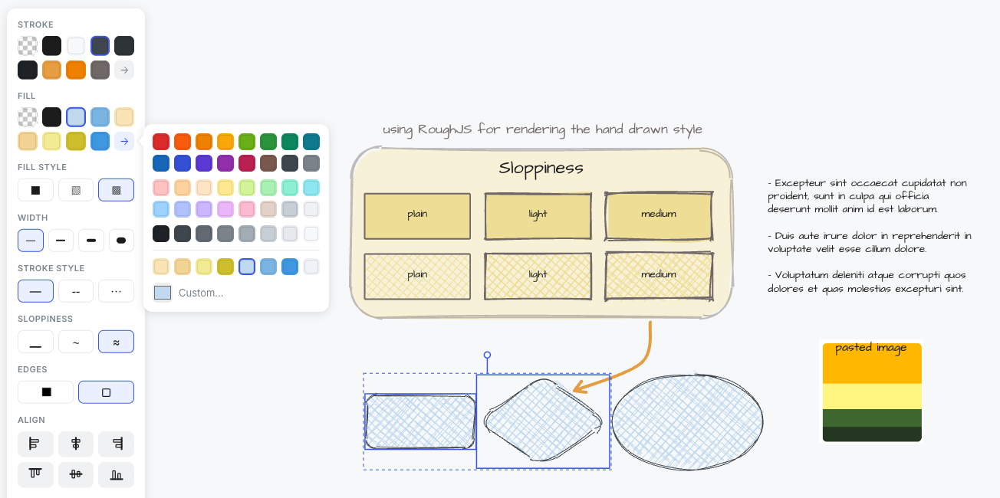
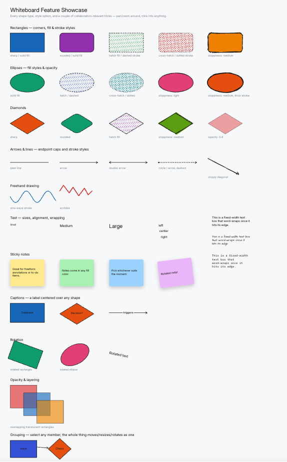
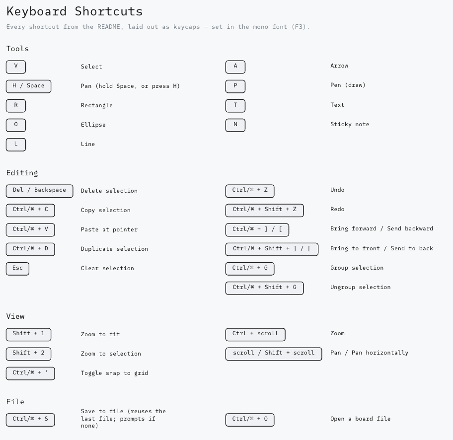

# Excali-Clone

A hobby project — my own version of Excalidraw. Draw rectangles, ellipses, lines, arrows, freehand shapes, text, and sticky notes, all with that hand-drawn look.

This is built mainly for **offline, local use**. Everything runs in your browser and boards save/open as a `.json` file — no server or account needed.



It also supports live sharing — just add `?room=<anyname>` to the URL and anyone with that link edits the same board with you, live. That's a nice extra, but not the main point of this project.

Built almost entirely by Claude — Opus did the planning, Sonnet did the implementation. I just steered the ship.

## Features

- Tools: select, pan, rectangle, ellipse, line, arrow, freehand pen, text, sticky notes
- Multi-point lines & arrows — click to place as many points as you like, then select,
  move, add and delete points to shape the curve
- Infinite canvas, pan & zoom
- Undo/redo, copy/paste, duplicate
- Grouping, layering, opacity, rotation
- Style options: fill, stroke, sloppiness, and more
- Save/open boards as a local `.json` file (`Ctrl/⌘ + S` / `O`)
- Works fully offline, boards persist across restarts

  
*feature-showcase.json sample file*
## Getting started

Requires **Node.js 22+**.

```bash
npm install
npm run dev
```

Open <http://localhost:5173>.

## Configuration

**Server** (`server/.env` — see `server/.env.example`):

| Variable          | Default     | Purpose                                        |
| ----------------- | ----------- | ----------------------------------------------- |
| `PORT`            | `1234`      | WebSocket/HTTP port                             |
| `HOST`            | `0.0.0.0`   | Bind address                                    |
| `ALLOWED_ORIGINS` | *(all)*     | Comma-separated origin allowlist                |
| `PERSISTENCE_DIR` | *(off)*     | Directory for saving boards; unset = in-memory  |

**Client** (`client/.env` — see `client/.env.example`):

| Variable      | Default             | Purpose               |
| ------------- | ------------------- | ---------------------- |
| `VITE_WS_URL` | `ws://<host>:1234`  | WebSocket server URL   |

## Keyboard shortcuts

  
*keyboard-shortcuts.json sample file*

**Tools**

| Key | Action | &nbsp; | Key | Action |
| --- | ------ | :---: | --- | ------ |
| `V` | Select | &nbsp; | `A` | Arrow |
| `H` / hold `Space` | Pan | &nbsp; | `P` | Pen (draw) |
| `R` | Rectangle | &nbsp; | `T` | Text |
| `O` | Ellipse | &nbsp; | `N` | Sticky note |
| `L` | Line | &nbsp; | | |

**Editing**

| Key | Action | &nbsp; | Key | Action |
| --- | ------ | :---: | --- | ------ |
| `Del` / `Backspace` | Delete selection | &nbsp; | `Ctrl/⌘ + Z` | Undo |
| `Enter` | Edit the selected shape's text | &nbsp; | `Ctrl/⌘ + Shift + Z` | Redo |
| `Ctrl/⌘ + C` | Copy selection | &nbsp; | `Ctrl/⌘ + ]` / `[` | Bring forward / Send backward |
| `Ctrl/⌘ + V` | Paste at pointer | &nbsp; | `Ctrl/⌘ + Shift + ]` / `[` | Bring to front / Send to back |
| `Ctrl/⌘ + D` | Duplicate selection | &nbsp; | `Ctrl/⌘ + G` | Group selection |
| `Esc` | Clear selection | &nbsp; | `Ctrl/⌘ + Shift + G` | Ungroup selection |
| Arrow keys | Nudge selection (`Shift` = bigger step) | &nbsp; | | |

Double-click opens the text editor too — except on lines and arrows, where double-click
opens point editing instead (see below), so `Enter` is how you label those.

**Lines & arrows**

Drag to draw a straight line. Or **click** once and keep clicking to place as many points
as you like — the curve bends through all of them as you go. Finish with `Enter`, `Esc`,
a double-click, or by clicking the last point again; either way the line is kept.

Double-click a line to edit its points. Small dots appear between the points — drag one
to insert a new point there.

| Input | Action | &nbsp; | Input | Action |
| --- | ------ | :---: | --- | ------ |
| Click a point | Select it; drag to move it | &nbsp; | `Del` / `Backspace` | Delete the selected points |
| `Shift` + click | Add/remove a point from the selection | &nbsp; | `Esc` | Step back out one level |

Deleting always leaves at least two points, so the line survives — to delete the line
itself, press `Esc` first, then `Del`. `Esc` unwinds one level at a time: selected points
→ point editing → the shape.

**View**

| Key | Action | &nbsp; | Key | Action |
| --- | ------ | :---: | --- | ------ |
| `Shift + 1` | Zoom to fit | &nbsp; | `Ctrl`+scroll | Zoom |
| `Shift + 2` | Zoom to selection | &nbsp; | scroll / `Shift`+scroll | Pan / Pan horizontally |
| `Ctrl/⌘ + '` | Toggle snap to grid | &nbsp; | | |

**File**

| Key | Action | &nbsp; | Key | Action |
| --- | ------ | :---: | --- | ------ |
| `Ctrl/⌘ + S` | Save to file (reuses the last file; prompts if none) | &nbsp; | `Ctrl/⌘ + O` | Open a board file |

## License

MIT
